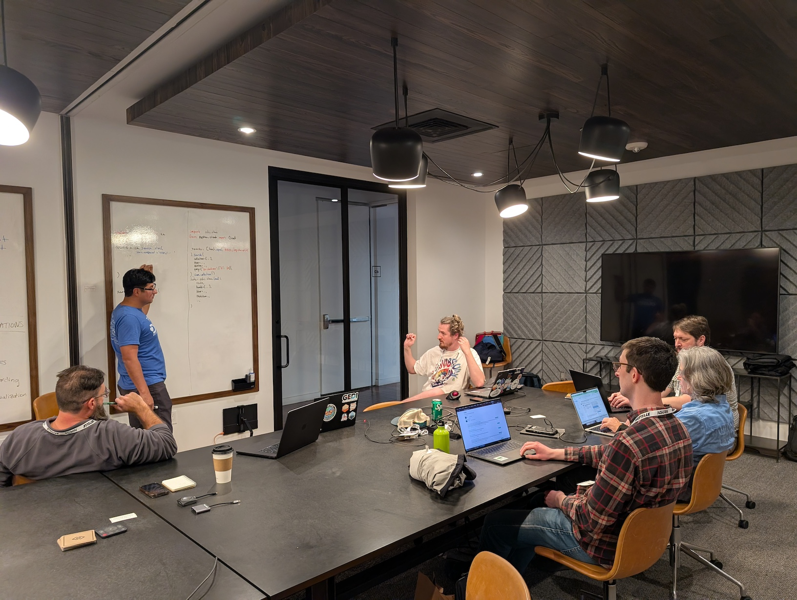

*Cross-posted at [openscapes.org/events](https://openscapes.org/events), [nasa-openscapes.github.io/news](https://nasa-openscapes.github.io/news.html), [nmfs-openscapes.github.io/blog](https://nmfs-openscapes.github.io/blog)*

------------------------------------------------------------------------

### Details at <https://openscapes.org/events/2026-07-27-esip-hackday/>

{fig-alt="5 people seated around a rectangular table with laptops open looking a a person standing pointing to a whiteboard" fig-align="left" width="50%"}
