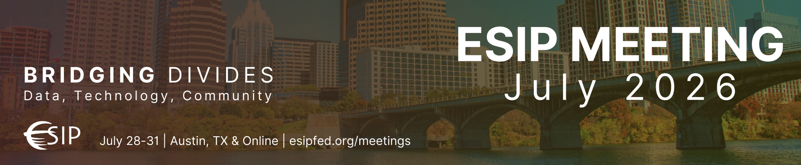

ESIP - Earth Science Information Partners - is a home for Earth science data
and computing professionals - a neutral space for exciting cross-domain
collaborations. The [summer conference](https://2026julyesipmeeting.sched.com/)
sessions bring together the community for hands-on, interdisciplinary deep
dives as they explore "Bridging Divides: Data, Technology, Community" this year
in Austin, Texas.

Please find us at these sessions!

### Monday Hackday!

- Monday, July 27, 11:00am - 12:30pm CDT: [Openscapes Hackday](https://2026julyesipmeeting.sched.com/event/2PWWU/openscapes-hackday)
 Co-organizers and speakers: Julia Lowndes, Eli Holmes, Amy Steiker, Daniel Kaufman, Ian Carroll, Ronny A. Hernández Mora, Mikala Beig, 
Ileana Fenwick, Luis Lopez, Michele Thornton. 

### Openscapes co-leading sessions with NASA and NOAA Fisheries

(our 3 Wednesday sessions)

- Wednesday, July 29, 9:00 - 10:30 PT: [Facilitating Scientists' Learning While Stress Testing Open Science Principles via Openscapes](https://2026julyesipmeeting.sched.com/event/2OZt1/facilitating-scientists-learning-while-stress-testing-open-science-principles-via-openscapes)
 Co-organizers and speakers: Julia Lowndes, Alexis Hunzinger, Daniel Kaufman, Eli Holmes, Mike Liddel.

- Wednesday, July 29, 2:00pm - 3:30pm CDT: [Bridging Divides and Getting to Yes](https://2026julyesipmeeting.sched.com/event/2OZtH/bridging-divides-and-getting-to-yes)
 Co-organizers and speakers: Julia Lowndes, Eli Holmes, Mike Liddel, Megan Cromwell, Michele Thornton, Erin Robinson.

- Wednesday, July 29, 4:00pm - 5:30pm CDT: [earthaccess: Five Years of Open Source Science Leadership at NASA](https://2026julyesipmeeting.sched.com/event/2OZtQ/earthaccess-five-years-of-open-source-science-leadership-at-nasa)
 Co-organizers and speakers: Julia Lowndes, Luis Lopez, Amy Steiker, Ian Carroll, Daniel Kaufman, Justin Rice.

### Virtual stores and community building with NASA and NOAA Fisheries Mentors

- Wednesday, July 29: 8:30am - 10:00am CDT [Bridging Human Silos: Setting Up Data-Centric Communities of Practice to Reach Across Divides](https://2026julyesipmeeting.sched.com/event/2OZss/bridging-human-silos-setting-up-data-centric-communities-of-practice-to-reach-across-divides)
 Co-organizers and speakers: Mikala Beig, Diane Fritz, Aimee Neeley

Luis Lopez Wednesday morning session

- Wednesday, July 29, 8:30am - 10:00am CDT: [Closing the ARCO Adoption Gap: Modernizing Data Analysis Workflows](https://2026julyesipmeeting.sched.com/event/2OZsm/closing-the-arco-adoption-gap-modernizing-data-analysis-workflows)
 Co-organizers and speakers: Eli Holmes, Luis Lopez, Thomas Cram, Harsha Hampapura.

Tuesday Aimee Barciauskas' 2-part session

- Tuesday, July 28, 4:00pm - 5:30pm CDT: [Virtual Stores: Bridging Archival Formats with Cloud-Native Access (Part 2)](https://2026julyesipmeeting.sched.com/event/2OZsa/virtual-stores-bridging-archival-formats-with-cloud-native-access-part-2)
 Co-organizers and speakers: Aimee Barciauskas, Owen Littlejohns, Daniel Kaufman, Chris Battisto, Max Jones. 

### Mentor Community Time

We have a few ideas for Openscapes Mentors to connect during ESIP week. These
are all no-host ideas (i.e. everyone pays for themselves):

 - Monday Social Hour this will be post-Hackday and open to all! Location: TBD,
 we'll update here.
- Thursday early walk this will be ~6:30am before breakfast, Mentors-only time
to connect half-way through ESIP, and think about the unconf
time and going forward 
- Thursday dinner this will be Mentors-only social time somewhere fun, and we
can meet up/invite others following dinner! Location: TBD, we'll update here.

{fig-alt="banner image with background photo of blue
sky, a mountain, and Seattle skyline, with white letters saying ESIP MEETING
July 2025. Innovation to Impact." fig-align="center" width="80%"}
