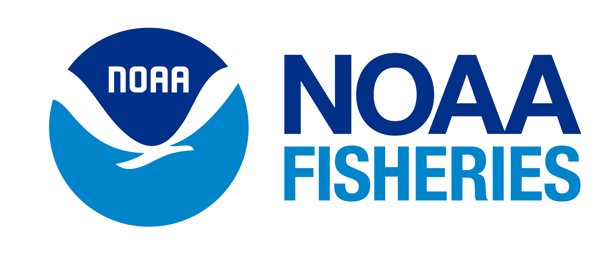

<!--- **This Cohort has completed.** Their work is featured in a [blog post](https://openscapes.org/blog/2026-02-26-nmfs-champions-2025/), "Cloud migration and data preservation progress across NOAA Fisheries - Fall 2025 Champions Recap. How the Openscapes Champions Program is advancing open science at NOAA Fisheries." --->

**The NOAA Fisheries Open Science Champions Cohorts are coming (back) this fall.** [**Sign up by Sept 8**](https://docs.google.com/spreadsheets/d/1hLmrrvajZb9yR8Vt8ngUPp4wdCeBeYjFBxb02OvX4nU/)**!** <!---The self-nomination process is now closed.---> These Cohorts directly support staff and teams as they work on workflow and data modernization goals. The Champions Cohorts help people across centers and offices address cross-regional workflow and data-sharing challenges by applying cloud and [open science](https://www.fisheries.noaa.gov/science-data/open-science-noaa-fisheries) approaches and building reproducible data science workflows and tools. Read more about the work done by our [2025 cohorts](https://nmfs-openscapes.github.io/blog/2026-02-26-nmfs-champions-2025/).

The Openscapes Champions Cohorts will run from September to November 2026. Participants will focus on personal or team goals related to improving science and data workflows through a series of facilitated sessions and lessons. This is a 10-week program with bi-weekly 1.5-hour group sessions. FTEs and Affiliates across all job titles from any Fisheries Science Center, Regional Office, or HQ Office are welcome to participate at no cost to you or your office/center. There are no prerequisites. All skill sets and skill levels are welcome. You can choose any of the 3 cohort times:

- **Cohort-A: Sep 22, Oct 6, 20, Nov 3, 17.** Tuesdays 1:00pm - 2:30pm PT.
- **Cohort-B: Sep 23, Oct 7, 21, Nov 4, 18.** Wednesdays 10:00 - 11:30am PT.
- **Cohort-C: Sep 23, Oct 7, 21, Nov 4, 18.** Wednesdays 1:00 - 2:30pm PT.

**2026 Theme: “Making your work and processes understandable, transferable, and open”**. This theme is about creating workflows that are more accessible to your entire team, and giving you dedicated time to invest in habits to make this easier. Some ideas for potential topics include:

- Onboarding to a new role or position and interested in developing an open science mindset and connecting with people in similar situations at NOAA Fisheries.

- Offboarding from your projects and wanting to document and share your processes for others (or your future self).

- Documenting your IT or procurement workflows, since these underpin all projects and can be a way to connect and streamline processes.

- Transitioning to cloud workflows and wanting to learn how others approach data and workflow optimization, project management, and refactoring.

- Supporting your staff or team as they transition their processes and wanting to better understand how they work and their needs.

However, we welcome anyone to participate! You do not need to work on a goal related to the theme.

**More info, including FAQs and the schedule for “Ask us anything” sessions are on the** [Champions page](https://nmfs-openscapes.github.io/champions). Signing up with a team or having a project in mind is not a requirement, but you are welcome to sign up as a team or come with a project you need to get done.

[**Openscapes**](https://openscapes.org) **is an approach for doing better science in less time** [@lowndes2017]. We help research groups reimagine data analysis, develop modern skills that are of immediate value to them, and cultivate collaborative and inclusive research communities. Openscapes' mentorship and community engagement approaches center on open data science as kinder science [@lowndes2019], enabling increased efficiency and resilience for teams so that their work has more enduring impact.

[Openscapes Champions](https://openscapes.org/initiatives#champions-program) is an open data science mentorship program for science teams. It is a multi-month program that is designed to ignite incremental and sustainable change within research teams and beyond. It helps teams get their own work done, while building skills and community within the realities of scientists’ busy schedules, varying expertise and needs. **From September through November 2026, 120 NMFS researchers will participate in 3 concurrent cohorts.**

[**Sign up by Sept 8**](https://docs.google.com/spreadsheets/d/1hLmrrvajZb9yR8Vt8ngUPp4wdCeBeYjFBxb02OvX4nU/)**!**

### Resources

- [NMFS Openscapes](https://nmfs-openscapes.github.io)
- [NMFS Openscapes Champions Cohorts](https://nmfs-openscapes.github.io/champions.html)
- Blog posts about [NMFS Openscapes](https://openscapes.org/blog#category=noaa-fisheries) and past [Champions](https://openscapes.org/blog#category=champions)
- [Nationwide Openscapes Training at NOAA Fisheries Science Centers: Facilitating Collaboration, Skill-sharing, and Open Science](https://openscapes.org/blog/2023-01-24-noaa-nmfs-fall/)
- [NMFS Open Science](https://nmfs-opensci.github.io/)

{fig-alt="logo of NOAA Fisheries on left with text NOAA FISHERIES on right" width="30%"}
