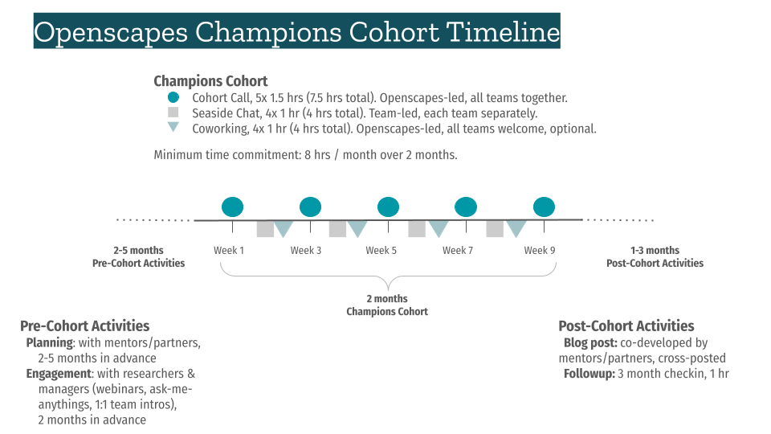

The NMFS Openscapes Mentor Community will be leading 3 Champions Cohorts in Fall 2024! Read on to learn what this is and how to sign up.

[SIGN UP FOR FALL](https://nmfs-openscapes.github.io/champions.html#sign-up-for-fall-2024) by Sept 23, 2024.

## What is the Champions Program?

40 staff from across NMFS come together bi-weekly to work on goals related to data science workflows. Do you want an opportunity to make progress on a project you are already working on? Do you or your team have a ‘big goal’ that involves changing how you work and you want to make progress on making your data and science workflows more efficient and reproducible (however you define that)? Do you want to migrate to new data and science workflows, like cloud-based workflows, but don’t know how to get started? Do you want to connect with others across NMFS who are interested in Open Science, Open Data and Open Source? The Fall Openscapes Champions Cohorts are for you (and your team)! Make progress on those goals that seem so intangible and hard to get traction on by working in facilitated sessions with your peers and the Openscapes team. [Scroll the blogs](https://nmfs-openscapes.github.io/blog.html#category=champions) on what NMFS teams and individuals have accomplished in the 10 NMFS Champions Cohorts over the past 3 years.

Openscapes Champions is a remote-by-design, cohort-based mentorship program that helps teams re-imagine data analysis and stewardship as a collaborative effort, develop modern skills that are of immediate value to them, and cultivate collaborative and inclusive communities. It is focused on open science and data modernization via biweekly curriculum that Openscapes has improved over 24 Cohorts 2019-2024. The goal is strengthening a teaching and learning culture within teams and organizations. This program is not only for scientists: admin, IT staff, and beyond are welcomed. Individuals and teams do not have to have familiarity or expertise in open science, data science, or coding, to benefit from the Openscapes Champions Program.

```{=html}
<!--- Through Openscapes cohorts, you focus on your own work with your peers or a team. As the program introduces modern concepts, tooling, and examples from your peers for collaborative open data science, groups focus on where you are and where you want to go together. **Openscapes Champions is "not your traditional training/workshop" because teams:**

-   Have real-world experiential learning: developing psychological safety and habits for implementing change
-   Learn together and get unstuck: Identify and make progress on barriers as Openscapes introduces modern concepts, tooling, and examples from peers
-   Work on what is important to them, often something hard to do. Something they want to change.
--->
```
## Champions Program Details

**Fall NMFS Openscapes Champions Cohorts will run from October-December 2024!** We will meet as a cohort five times over two months, on alternating weeks, with additional optional coworking times.

-   **Date-Times**:
    -   **Cohort-A: Oct 8, 22, Nov 5, 19, Dec 3**. Alternating Tuesdays from 11:00am - 12:30pm PT.
    -   **Cohort-B: Oct 9, 23, Nov 6, 20, Dec 4**. Alternating Wednesdays from 10:00 - 11:30am PT.
    -   **Cohort-C: Oct 9, 23, Nov 6, 20, Dec 4**. Alternating Wednesdays from 1:00 - 2:30pm PT.
-   **Where:** remotely, via Google Meet
-   **What we learn:** [Champions program core lessons](https://openscapes.github.io/series), with NOAA Fisheries examples
-   **Cost:** Free; this opportunity is supported by NOAA funding to Openscapes
-   **Expected time commitment:** 8hrs/month for 2 months is a minimum expected time commitment. This accounts for 3 hours/month of synchronous Cohort Calls, optional Coworking hours, and team Seaside Chats where you plan with your research group to strengthen shared workflows.
-   **Who:** NMFS staff, affiliates, contractors, and others who are interested in improving their data science workflows. We aim to remove barriers to outside collaboration. It is important that those who participate can do so in all or most sessions, and are energized to be interacting with like-minded individuals across NOAA Fisheries. Sign up to participate individually, with a colleague or your team.

### Champions Cohort Timeline

This image gives a visual sense of time span, cadence, and time commitments for an Openscapes Cohort



## Sign up for Fall 2024

**Sign up with a colleague or team by Sept 23, 2024 via [this Google Spreadsheet](https://docs.google.com/spreadsheets/d/10zTz6i-ZuwnQhCTG63jRku0BtVwgc9e1tqnfGuiyM2c/edit?gid=1241468325#gid=1241468325)**. Please indicate the Cohort date-times you are available; we will confirm participation via email by Sept 25.

## Attend a "Why Openscapes" info session

To share about the opportunity, our goal in September is to give a talk at each Center/Regional Office. Here are [slides introducing the Fall 2024 Champions Program](https://docs.google.com/presentation/d/1a_nDKAxpvaWURITBm_HiDvzCd7GLDmb8ooi-d0dRI5I/edit?usp=sharing) with background information we can all use to present.

Table. Center / Office presentations

|            |             |                   |                                        |                               |                           |                                      |
|-----------|-----------|-----------|-----------|-----------|-----------|-----------|
| **Date**   | **Time**    | **Center/Office** | **Event info name / length**           | **Mentor/Point person**       | **Speaker**               | **Google Meet link**                 |
| 2024-08-29 | 2:30 pm PT  | SWFSC             | SWFSC Openscapes info session / 20 min | Lynn DeWitt, Heather Nicholas | Eli Holmes, Julie Lowndes | https://meet.google.com/nuh-xaap-yph |
| 2024-09-04 | 9:00 am HT  | PIFSC             | PIFSC Openscapes Q&A / 50 min   | Amanda Bradford               | Eli Holmes, Julie Lowndes | https://meet.google.com/gbo-ankc-sme |
| 2024-09-04 | 2:30 pm PT  | NWFSC             | NWFSC Openscapes Q&A / 30 min   | Eli Holmes                    | Eli Holmes, Julie Lowndes | https://meet.google.com/men-hfcv-yzd |
| 2024-09-05 | 11:00 am PT | All               | NMFS Openscapes Q&A / 50 min    | Eli Holmes                    | Eli Holmes, Julie Lowndes | https://meet.google.com/wqw-jnbj-vbq |
| 2024-09-05 | 3:00 pm ET | SEFSC              | SEFSC Openscapes info session / 50 min   | Ana Vaz, Molly Stevens, Adyan Rios | Eli Holmes, Julie Lowndes | https://meet.google.com/eik-qnnw-rdh |
| 2024-09-11 | 12:00 pm PT | All               | NMFS Openscapes Q&A / 50 min    | Eli Holmes                    | Eli Holmes, Julie Lowndes | https://meet.google.com/wqw-jnbj-vbq |
| 2024-09-13 | 11:00 am AT | AKRO              | AKRO Openscapes Q&A / 50 min    | Eli Holmes                    | Eli Holmes, Julie Lowndes | http://meet.google.com/htn-jbcw-txr  |

### How to request a “Why Openscapes” talk & AMA

Want help encouraging your colleagues to sign up? To request a presentation & AMA, select a time from Eli’s calendar and add Julie (julia at openscapes.org) and Stefanie (stefanie at openscapes.org). Eli has cleared Sept 2-14 for giving these presentations.

Please add sessions to [Sign up sheet, 'Talks, AMA Schedule'](https://docs.google.com/spreadsheets/d/10zTz6i-ZuwnQhCTG63jRku0BtVwgc9e1tqnfGuiyM2c/edit?gid=1423956583#gid=1423956583) tab and to the NMFS Open Science Google Calendar so others can find it. Stef will add them to the following table.

## What is a team?

> How you define 'team' is completely up to you and having one person be in the cohort and using in-between session 'seaside chats' to bring back the information to another group is 100% fine. That is common in the cohorts. In my first Openscapes cohort, I was the only person from my project. My personal goal was to use the Openscapes structure to help a team that I am on figure out how to tackle some off-boarding tasks due to a retirement. During my second cohort, there were 2 team members in the cohort and 2 not in the cohort. We focused on standardizing our data to get ready for our GitHub served data package. For the 3rd cohort I am doing, 2⁄3 of our team is in the cohort as we start to get organized for a major revamp of our report into a reproducible workflow. - **Eli Holmes (NMFS Open Science, NWFSC, NMFS Openscapes)**

Teams do not need to be a formal research group; they can be collaborating in other ways. Team members do not all need to have technical or data interests, but share a curiosity and interest in improving something about how they work.

**Q: What if I don’t have a team?**

**A:** That’s ok, please sign up! We’ll help you connect with participants who share some of your goals or needs.

**Q: If a team is participating together, how important is it for them all to be in the same cohort?**

**A:** Not too important. Sometimes people feel more 'connected' if they see people they know in the virtual room. The activities during the cohort calls are not by 'team'; they are in random breakout groups. Participants are expected to have ‘Seaside Chats’ together with their teams in the weeks between Cohort Calls. It’s more important that participants are committed to attending all sessions in the time slot they have chosen.

**Q: Can I sign up if I have participated in a previous Openscapes Champions Cohort?**

**A:** Yes. If Cohorts are oversubscribed, this would be discussed by a small selection committee.

See [Frequently Asked Questions](https://openscapes.org/faq) for more guidance on teams.

## Stories from past participants

### Kourtney Burger, Biological Science Technician, SWFSC Acoustic Ecology Lab.

Kourtney participated in a PIFSC-SWFSC Cohort in Fall 2022. She shared her experience in a post for the NOAA Fisheries blog: [Sound Bytes: Championing Open Science](https://www.fisheries.noaa.gov/science-blog/sound-bytes-championing-open-science). In it, Kourtney describes how she transferred a field methods manual from a set of disparate files on Google Drive to a [Quarto web book on GitHub](https://sael-swfsc.github.io/adrift-field-methods/).

> “Seaside Chats with our SAEL team allowed those of us attending the Openscapes workshop to share our newfound knowledge and experience so we could make our science more open. During these sessions, we streamlined our science pathways, documented our methods through GitHub, and had general team strategy discussions.” - **Kourtney Burger, SWFSC**

### Marine Mammal Laboratory (MML) Stock Assessment Report team from AFSC.

Rod Towell, Nancy Young, Tony Orr, Erin Richmond, and Brian Fadely participated in an Openscapes Champions Cohort in Winter 2022 and shared the story of the impact on their reporting and team culture (13-min [recording](https://youtu.be/whC4FyHuVg8) \| [slides](https://docs.google.com/presentation/d/16oScbiL9cXvcUZCpsquc39csq0SbP6vSX3CJ6L4wc7w/) with detailed notes).

> "Learning WITH each other, FROM each and FOR each other" **- Rod Towell, AFSC**

Impetus - SAR process is overwhelming and inefficient.

-   Annual process with overlap between years 
-   Large project: \>400 pages
-   Multiple authors, collaborators, and internal/external reviewers 
-   Version control issues
-   No easy way to track discussions, decisions, ideas for future years
-   No cohesive or formalized on/off-boarding, protocols

MML SAR Team goals

-   Reframe SAR development as a collaborative effort
-   Incorporate new tools but meet staff where they are
-   Maintain consistency with NMFS SAR approach

Reflections

-   Motivated team, commitment, endurance, good communication and collaboration 
-   This is a fluid, adaptive and dynamic process
-   Used skills and problem-solving processes learned from Openscapes; the status quo was not acceptable so change was necessary
-   Change is incremental - it doesn't have to happen all at once!
-   Time, energy, commitment -\> Reward!

## Mentor roles

The growing [NMFS Openscapes Mentor community](https://nmfs-openscapes.github.io/mentors/) — staff from across NOAA Fisheries interested in supporting others with teamwork and open science — will be increasingly involved with Champions Cohorts, and point-people for questions about what is involved and how to sign up. Mentors play different roles during different phases of Champions Cohorts.

**Pre-cohort engagement:** Mentors are empowered to encourage their colleagues to sign up for Openscapes Champions Cohorts. The Openscapes team will support you in preparing to present to an all-hands or brown bag session, or you can invite us to present (see [Pre-cohort engagement](champions.qmd#pre-cohort-engagement) below).

**During cohort:** Mentors participate in the Champions Program (in fact, Champions cohorts are scheduled as "takeovers" of regular Mentors calls to be mindful of Mentors' time commitments). Here are several roles where Mentors can contribute:

-   Participant (bring your team as Champions)
-   Recruiter (engage others in your Center / Office to encourage them to participate)
-   Mentor (Content expert, model live notetaking, contribute to debriefing)
-   Guest teacher - running a themed Seaside Chat, or (learn to) lead GitHub clinics
-   Helpers - Coworking / Seaside Chat (fix merge conflict, add documentation)
