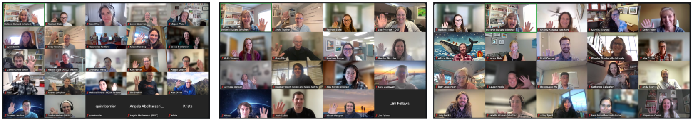

::: {style="text-align:center;"}
{fig-alt="3 screenshots of video call participants each in a 5 by 5 or 4 by 4 grid. People are smiling and waving." fig-align="center"}
:::

We led 3 concurrent [Openscapes Champions](https://nmfs-openscapes.github.io/champions.html) Cohorts for NOAA Fisheries in fall 2025. These were cohorts 14 to 16 for NOAA Fisheries, involving over 600 staff and affiliates in total! Participants included teams and individuals from all 6 NOAA Fisheries Centers - [Pacific Islands](https://www.fisheries.noaa.gov/about/pacific-islands-fisheries-science-center), [Southwest](https://www.fisheries.noaa.gov/about/southwest-fisheries-science-center), [Southeast](https://www.fisheries.noaa.gov/about/southeast-fisheries-science-center), [Northwest](https://www.fisheries.noaa.gov/about/northwest-fisheries-science-center), [Northeast](https://www.fisheries.noaa.gov/about/northeast-fisheries-science-center), [Alaska](https://www.fisheries.noaa.gov/about/alaska-fisheries-science-center) - along with the Office of the Chief Information Officer ([OCIO](https://www.noaa.gov/organization/information-technology/about-ocio)), Office of Science and Technology ([OST](https://www.fisheries.noaa.gov/about/office-science-and-technology)), National Ocean Service ([NOS](https://oceanservice.noaa.gov/)), Integrated Ocean Observing System ([IOOS](https://ioos.noaa.gov/)), Southeast Regional Office ([SERO](https://www.fisheries.noaa.gov/about/southeast-regional-office)), West Coast Region ([WCR](https://www.fisheries.noaa.gov/about/west-coast-region)), Pacific Islands Regional Office ([PIRO](https://www.fisheries.noaa.gov/about/pacific-islands-regional-office)), and Office of Protected Resources ([OPR](https://www.fisheries.noaa.gov/about/office-protected-resources)). This post is a summary and celebration of some of their work.

Their work is featured in a [blog post](https://openscapes.org/blog/2026-02-26-nmfs-champions-2025/): "Cloud migration and data preservation progress across NOAA Fisheries - Fall 2025 Champions Recap. How the Openscapes Champions Program is advancing open science at NOAA Fisheries".

# Continued support

At the conclusion of the training, several cohort members joined the [NMFS Openscapes Mentors community](../mentors) or participated in the [Data Academy](../data-academy.qmd) training.
