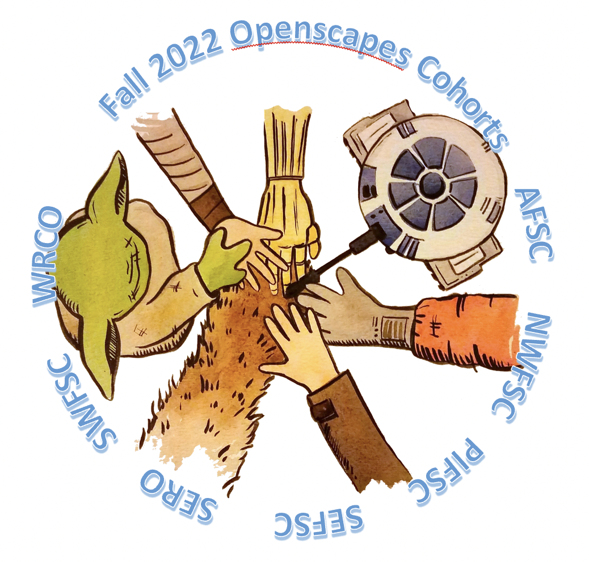
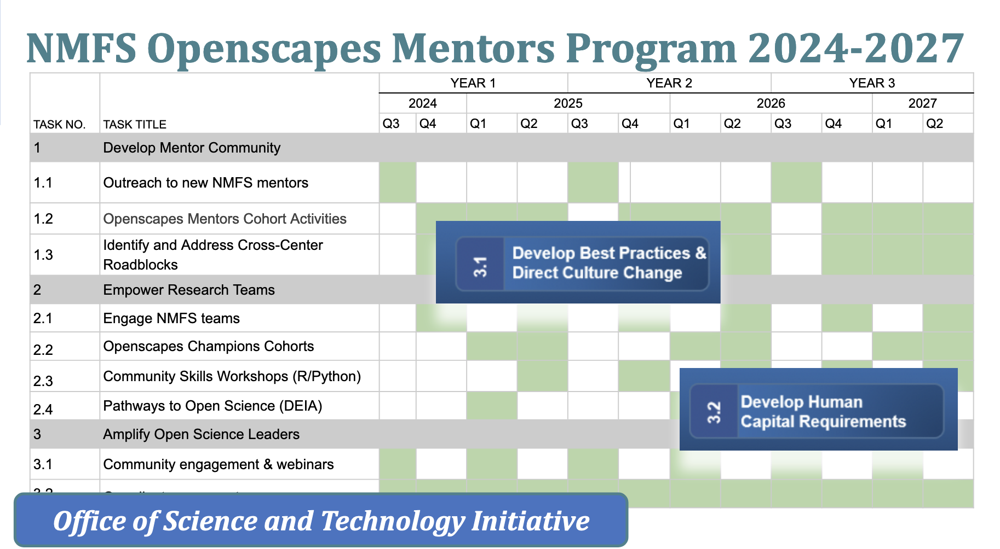

NMFS Openscapes is a multi-year collaboration between NOAA Fisheries and [Openscapes](https://www.openscapes.org/) to promote a data-driven culture through the adoption of open science initiatives: Fully Enable Open Science. Openscapes was named as a partner as the [Biden-Harris Administration announces $34 million to modernize NOAA Fisheries’ data, infrastructure and workforce](https://www.noaa.gov/news-release/biden-harris-administration-announces-34-million-to-modernize-noaa-fisheries-data-infrastructure-and) <!---to provide team-based training in reproducible scientific workflows and platforms--->. We have had 10 Openscapes Champions cohorts in 2020-2022 (400 staff! \[40 staff per cohort\]) involving all six science centers plus two regional offices, and began informally organizing as a mentor community. 

## NMFS Openscapes 3-year Framework and FY24 plan

As part of the NOAA Fisheries Data Modernization Strategy - funded for 3 years,  we plan to work with all six NMFS science centers, five regional offices, and the Office of Science and Technology. We have three synergistic Objectives:

1.  **Develop a mentor community**. We will develop a community of mentors across NMFS centers/offices. With Openscapes facilitation these mentors will learn and work together to strengthen Open Science skills at their center/office, co-create reusable resources for NMFS-specific scientific products, and empower their colleagues via local activities and trainings.
2.  **Empower scientific teams**. We will support center/office researchers to become high-functioning teams as they transition to Open Science and reproducible scientific workflows through the Openscapes' Champions and Pathways to Open Science programs and other Community Skill Building Workshops. Cohorts can include teams from the same or across centers/offices, or be topic specific (like stock assessment reports) to strengthen relationships and shared practices.
3.  **Amplify Open Science leaders**. We will amplify NMFS Open Science leaders and leverage synergistic efforts within NMFS and NOAA. We will focus on opportunities and recognition for staff who support their colleagues, which is critical to upskilling the NMFS workforce, deepening leadership capacity within NOAA, and connecting to the global Open Science movement.

**Aug-Sept 2024**: Openscapes Mentors FY24 Program Kick-off! Please see the [**Mentors Community Page**](https://nmfs-openscapes.github.io/mentors/activities.html) for more details about our schedule.

**October-December 2024**: Openscapes Champions cohorts. We are planning three simultaneous cohorts at science centers and regional offices much like in fall 2022.

{fig-alt="A screenshot of a spreadsheet gantt chart table showing Years 1-3 quarters as columns and Objectives as rows." fig-align="center" width="60%"}

## What is the impact of this?

What does shifting to open science look like across a federal agency like NOAA, and what are the impacts to the efficiency and quality of their scientific products? NOAA Fisheries colleagues share via a conference presentation and peer-reviewed publication:

[**A Year of Open Science Community Building at NOAA Fisheries**](https://www.youtube.com/watch?v=n1VaV8f6qQE&list=PLChfyH8TVDGnB_zDCm8d9oonMomfk8v9X&index=14). Eli Holmes (NOAA Fisheries Open Science), Evan Howell (Director of the Office of Science and Technology), Megsie Siple (Alaska Fisheries Science Center), Amanda Bradford (Pacific Islands Fisheries Science Center), Brian Fadely (Alaska Fisheries Science Center Marine Mammal Stock Assessments), Vivian Matter (Branch Chief of Southeast Fisheries Science Center), Kathryn Doering (Office of Science and Technology), Christine Stawitz (Office of Science and Technology), Carissa Geravsi (Gulf of Mexico Integrated Ecosystem Assessment), Lynn Dewitt (California Current Ecosystem Assessment Team). Year of Open Science Culminating Conference, March 21, 2024. 

[**Shifting institutional culture to develop climate solutions with Open Science**](https://doi.org/10.1002/ece3.11341). Julia Stewart Lowndes, Anna M. Holder, Emily H. Markowitz, Corey Clatterbuck, Amanda L. Bradford, Kathryn Doering, Molly H. Stevens, Stefanie Butland, Devan Burke, Sean Kross, Jeffrey W. Hollister, Christine Stawitz, Margaret C. Siple, Adyan Rios, Jessica Nicole Welch, Bai Li, Farnaz Nojavan, Alexandra Davis, Erin Steiner, Josh M. London, Ileana Fenwick, Alexis Hunzinger, Juliette Verstaen, Elizabeth Holmes, Makhan Virdi, Andrew P. Barrett, Erin Robinson (2024).  *Ecology and Evolution*, 14, e11341. 
